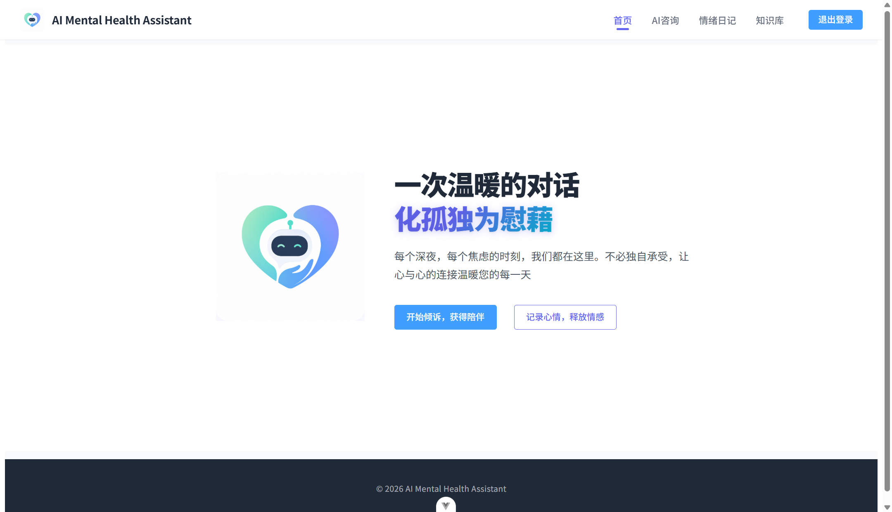
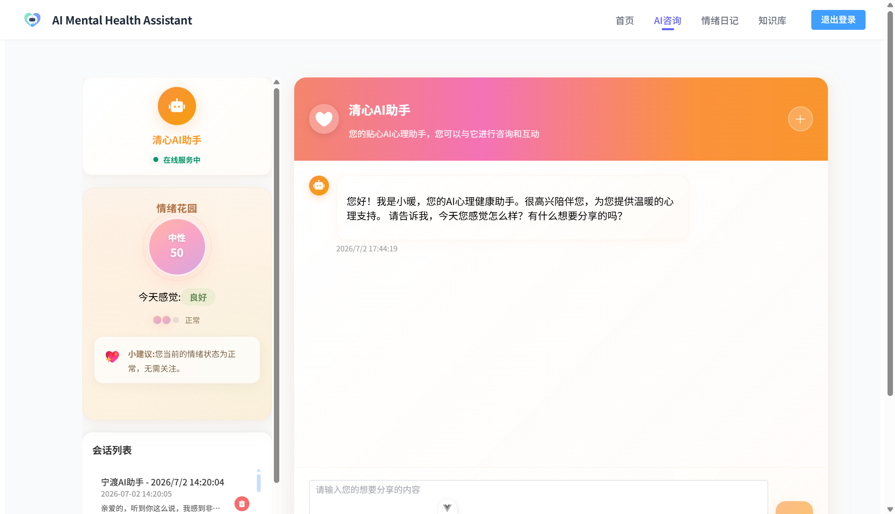
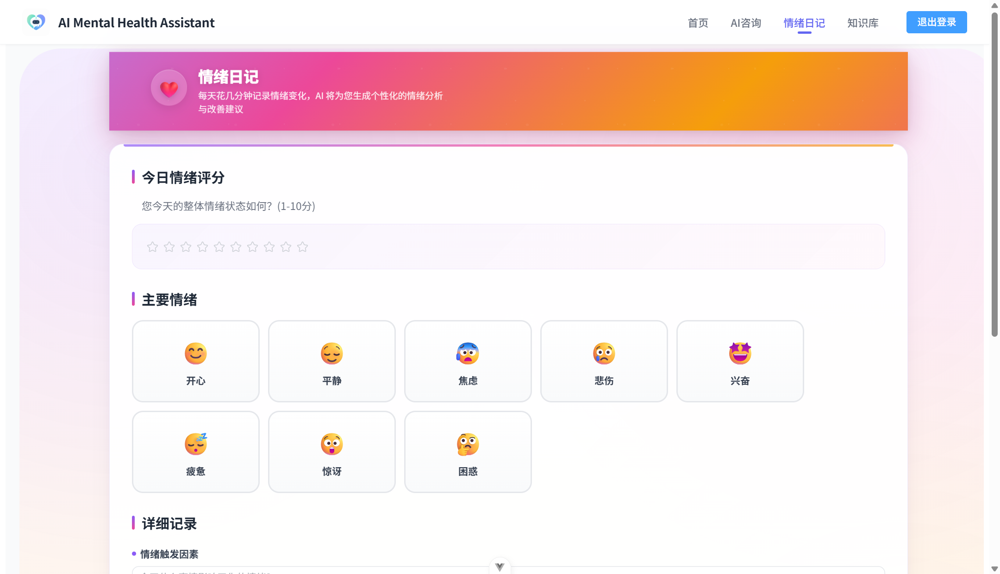
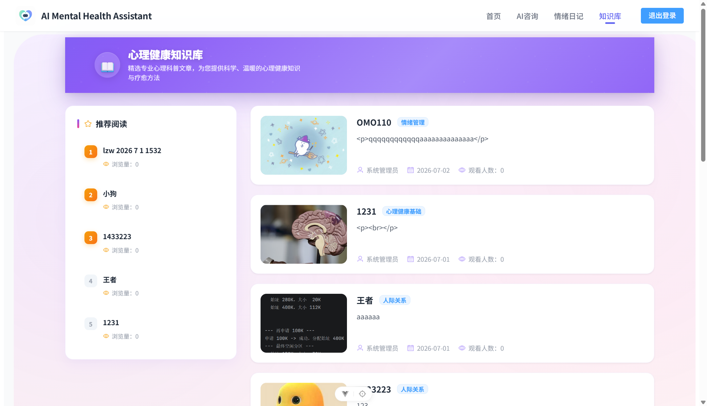
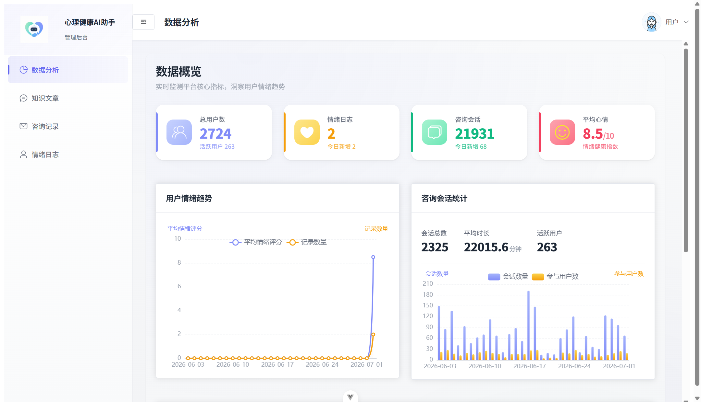
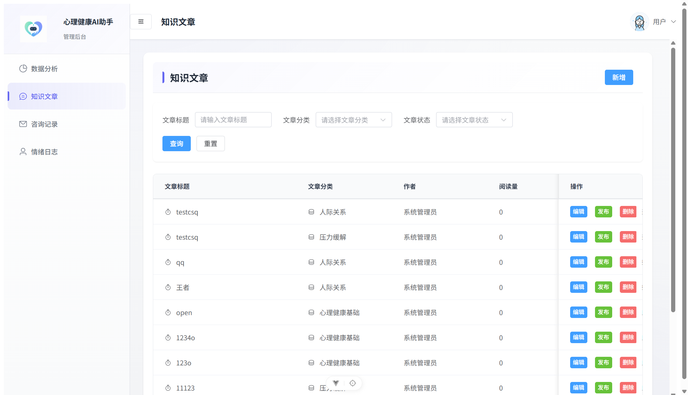
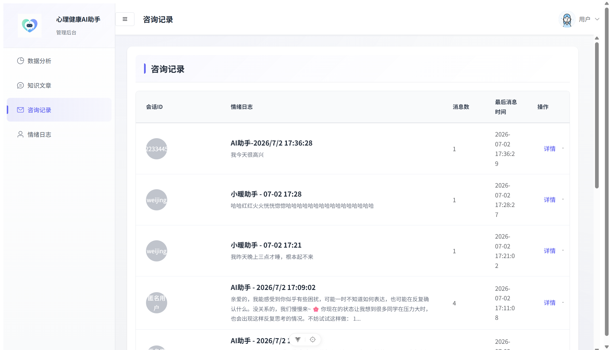
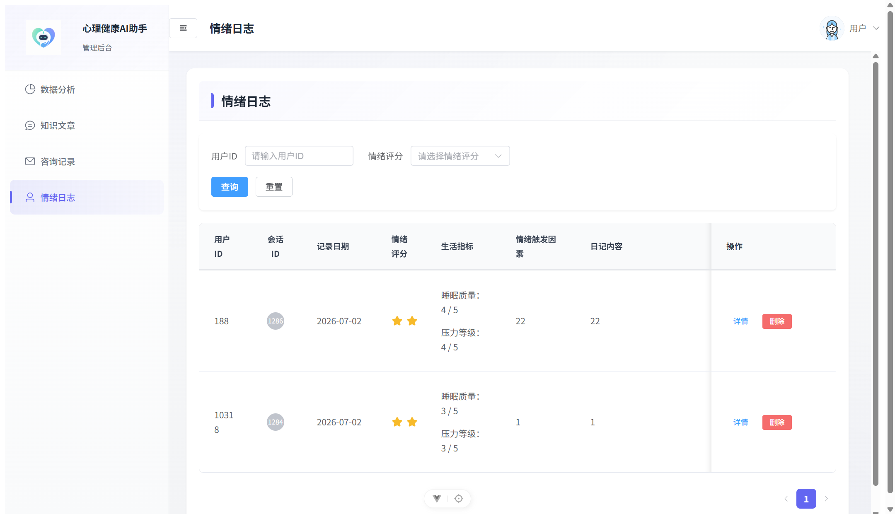

# 清心AI助手

**AI-powered mental health companion — intelligent emotional support, anytime, anywhere.**


***

## 项目简介

清心AI助手是一款基于 **Vue 3** 构建的 AI 心理健康支持应用。用户可以与 AI 助手进行实时对话，获得情绪分析、风险预警和个性化建议；同时提供情绪日记记录和心理知识库阅读功能，帮助用户更好地认识和管理自己的情绪状态。

> "一次温暖的对话，化孤独为慰藉"

## 功能特性

### 前台用户端

| 功能             | 说明                                |
| -------------- | --------------------------------- |
| 🤖 **AI 智能对话** | 基于 SSE 流式响应的实时心理支持对话，支持新建/切换/删除会话 |
| 🌻 **情绪花园**    | 可视化当前情绪状态，包含情绪分数、风险等级、温暖建议和治愈小行动  |
| 📝 **情绪日记**    | 记录每日心情评分、主要情绪、触发因素和生活指标，追踪情绪变化趋势  |
| 📚 **心理知识库**   | 浏览专业心理科普文章，支持分类筛选和 Markdown 富文本阅读 |
| 🔐 **用户认证**    | JWT 登录/注册，安全可靠的用户身份管理             |

### 后台管理端

| 功能          | 说明                   |
| ----------- | -------------------- |
| 📊 **数据看板** | 可视化图表展示用户情绪数据与系统运营指标 |
| 📄 **文章管理** | 心理知识文章的增删改查，支持富文本编辑器 |
| 💬 **咨询记录** | 查看用户对话记录与情绪分析结果      |
| 📋 **情绪日志** | 管理用户提交的情绪日记数据        |

## 技术栈

**前端**

- [Vue 3](https://vuejs.org/) — 渐进式 JavaScript 框架
- [Vite](https://vitejs.dev/) — 下一代前端构建工具
- [Element Plus](https://element-plus.org/) — Vue 3 组件库
- [Pinia](https://pinia.vuejs.org/) — 状态管理
- [Vue Router](https://router.vuejs.org/) — 路由管理
- [ECharts](https://echarts.apache.org/) — 数据可视化
- [Sass](https://sass-lang.com/) — CSS 预处理器
- [wangEditor](https://www.wangeditor.com/) — 富文本编辑器

**通信**

- [Axios](https://axios-http.com/) — HTTP 请求
- [fetch-event-source](https://github.com/Azure/fetch-event-source) — SSE 流式数据接收

## 项目结构

```
src/
├── api/                # 接口层（frontend / admin）
├── assets/             # 静态资源（图片、图标）
│   └── images/
├── components/         # 公共组件
│   ├── FrontendLayout.vue   # 前台布局外壳
│   ├── BackenLayout.vue     # 后台布局外壳
│   ├── AuthLayout.vue       # 登录注册布局
│   ├── MarkdownRenderer.vue # Markdown 渲染器
│   ├── RichTextEditor.vue   # 富文本编辑器
│   └── ...
├── config/             # 配置文件（API 地址等）
├── router/             # 路由配置（前台 + 后台）
├── stores/             # Pinia 状态管理
├── utils/              # 工具函数（Axios 封装等）
├── views/              # 页面组件
│   ├── home.vue              # 首页
│   ├── ai-cunsulations.vue   # AI 咨询对话
│   ├── emotion-diary.vue     # 情绪日记
│   ├── f-knowledge.vue       # 知识库列表
│   ├── articleDetail.vue     # 文章详情
│   ├── login.vue / register.vue  # 登录注册
│   └── ...                   # 后台管理页面
├── App.vue
└── main.js
```

## 快速开始

### 环境要求

- [Node.js](https://nodejs.org/) >= 20.19 或 >= 22.12
- npm 或 pnpm

### 安装与运行

```bash
# 1. 克隆项目
git clone https://github.com/your-username/ai-mental-health-assistant.git
cd ai-mental-health-assistant

# 2. 安装依赖
npm install

# 3. 启动开发服务器
npm run dev
```

浏览器访问 `http://localhost:5173` 即可查看。

### 生产构建

```bash
npm run build
```

构建产物位于 `dist/` 目录，可直接部署到任意静态服务器。

## 配置说明

在 `src/config/index.js` 中修改后端 API 地址：

```js
export const fileBaseUrl = 'http://your-api-server:port'
```

开发环境下，可通过 Vite 代理配置在 `vite.config.js` 中设置代理转发。

## 页面预览

### 客户端

#### 首页

Hero 区左右分栏布局，Logo 弹入动画 + 文字渐入，标题`化孤独为慰藉`采用紫-蓝-青三色渐变高亮文字，搭配毛玻璃导航栏。



#### AI 咨询

左右分栏：左侧情绪花园环形渐变情绪球带呼吸光晕，右侧聊天区青橙暖色渐变头部 shimmer 动画，消息气泡渐入上浮，发送按钮弹性缩放反馈。



#### 情绪日记

全屏宽彩虹流光渐变头部（紫-粉-金），情绪卡片选中时跑马灯彩虹边框旋转，提交按钮紫粉渐变悬浮上浮微交互。



#### 知识库

卡片网格布局，文章封面阴影悬浮上浮；详情页骨架屏加载、摘要区绿色左边框高亮、标签依次弹入。



### 管理端

#### 数据看板

四色统计卡片 + ECharts 图表，侧边菜单导航。



#### 文章管理

表格 + 筛选区，支持新增 / 编辑 / 发布 / 下线 / 删除操作。



#### 咨询记录

用户对话历史列表，可筛选查看。



#### 情绪日志

用户提交的情绪日记数据管理。



### 默认账号登录

客户端登录账号：

- 账号：allen
- 密码：123456

管理端登录账号：

- 账号：admin
- 密码：123456

